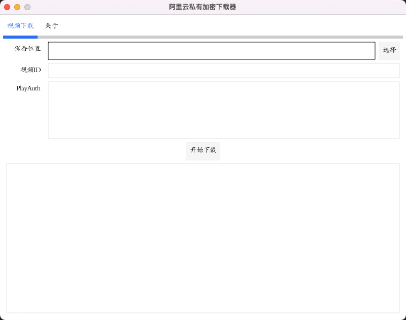
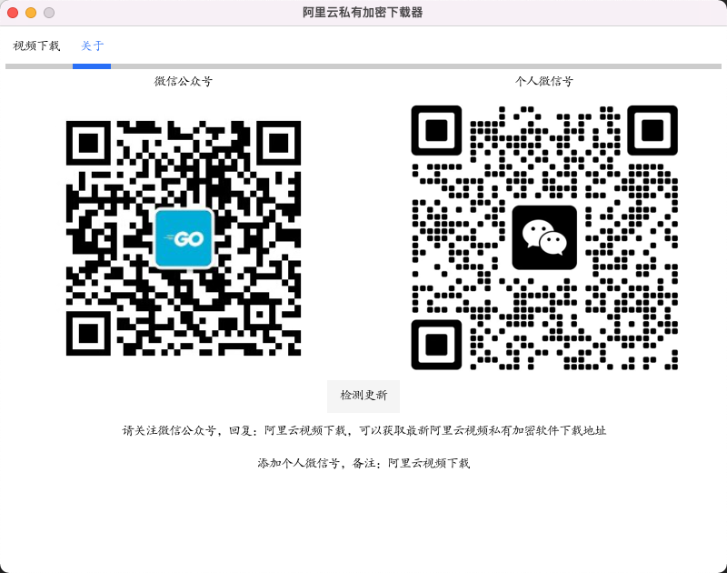

# aliyun-m3u8-downloader

aliyun-m3u8-downloader 是一个使用了 Go 语言编写的迷你 M3U8 下载工具, 支持阿里云m3u8私有加密。 该工具就会自动帮你解析 M3U8 文件，并将 TS 片段下载下来合并成一个文件。

本工具只供学习研究，如有侵权请联系删除

## 定制
可定制开发使用以下视频云服务的第三方平台下载器，详细咨询微信：lbbniu-com
- **阿里云私有音视频加密**
- **火山引擎视频云点播**
- **百度智能云视频点播**
- **华为云视频点播**

### 插件
目前支持的闭源全自动下载器插件包括：
- [光环国际](https://yun.aura.cn)
- [中公网校](https://www.eoffcn.com)
- [学培课堂](https://www.fhzjedu.com)
- [云上虎](https://www.huohujiaoyu.com)
- [慕课网体系课和实战课](https://www.imooc.com)
- [银成医考](https://wx.yixueks.com)
- [51cto](https://edu.51cto.com)
- [保利威 Polyv](https://www.polyv.net/)：支持v12(VRM12)、v13(VRM13)，其他版本待测试
- 某兽医app
- 极客时间训练营
- 图形化界面下载器，适合无计算机基础用户使用




## 功能

- 支持阿里云M3U8私有加密解密
- 下载和解析 M3U8（仅限 VOD 类型）
- 下载 TS 失败重试
- 解析 Master playlist
- 解密 TS
- 合并 TS 片段

## 用法

### 源码方式

```bash
# 交叉编译
CGO_ENABLED=0 GOOS=linux GOARCH=amd64 go build -ldflags "-s -w" -o m3u8-downloader
CGO_ENABLED=0 GOOS=darwin GOARCH=amd64 go build -ldflags "-s -w" -o m3u8-downloader
CGO_ENABLED=0 GOOS=windows GOARCH=amd64 go build -ldflags "-s -w" -o m3u8-downloader.exe
# 普通m3u8下载
go run main.go normal -u=https://www.lbbniu.com/index.m3u8 -o=/data/example --chanSize 1
# 阿里云m3u8私有加密
go run main.go aliyun -p "WebPlayAuth" -v 视频id -o=/data/example --chanSize 1
```

### 二进制方式:

Linux 和 MacOS

```
# 普通m3u8下载
./aliyun-m3u8-downloader normal -u https://www.lbbniu.com/index.m3u8 -o=/data/example --chanSize 1
# 阿里云m3u8私有加密
./aliyun-m3u8-downloader aliyun -p "PlayAuth" -v 视频id -o=/data/example --chanSize 1
# 火山引擎视频云视频下载
./aliyun-m3u8-downloader bytedance -p "PlayAuthToken" -o=/data/example --chanSize 1# 火山引擎视频云视频下载
# 百度智能云视频下载
./aliyun-m3u8-downloader baidu -u m3u8视频地址 -t token  -o=/data/example --chanSize 1
```

## 下载

[二进制文件](https://github.com/lbbniu/aliyun-m3u8-downloader/releases)

## 参考资料

- [https://github.com/SweetInk/lagou-course-downloader](https://github.com/SweetInk/lagou-course-downloader)
- [https://github.com/oopsguy/m3u8](https://github.com/oopsguy/m3u8)

## 联系开发者


## License

[MIT License](./LICENSE)
